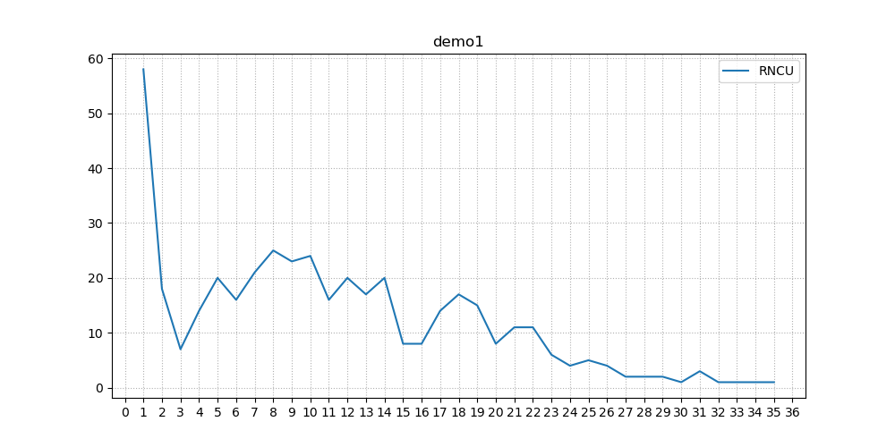

# Encounter and removal of UMI-overestimated index misassignment in deep sequencing

## Introduction

The pipeline includes two part. 

The first part consists of a series of shell scripts to help you to complete two things.

(1) set cutoff for each sample according its RNCU distribution with a pre-trained random forest model.

(2) remove reads with UMI whose RNCU does not meet the cutoff.


The second part provides you a pipeline to

(1) extract SNP information from sam files. 

(2) genotype for each loci

 

## Part 1

### Step 1: RNCU_distribution

(1) obtain RNCU of each UMI in each sample.

(2) generate RNCU distribution for cutoff setting 


**Script** 

(1) 01-distribution.sh


**Input file**

```
(1) demo.sam  
# UMI should be added after the first column
# raw data after mapping
1.QNAME-UMI 2.chr 3.start_pos 4.end_pos 5.....
```

**Parameters**

```
(1) -t number of threads to use  (default 1)
(2) -u the length of UMI
(3) -s path the raw data locate in
```

**Output**

| File                 | Description                 |
| -------------------- | --------------------------- |
| machine_X_index.txt  | RNCU categories             |
| machine_X_values.txt | read number of certain RNCU |

| Directory | Description                                              |
| --------- | -------------------------------------------------------- |
| RNCU      | contains files recording RNCU of each UMI in each sample |


### Step 2: Glance_distribution

(1) take a glance at the distribution of RNCU in each sample.


**Script** 

(1) glance_distribution.py


**Input file**

| File                 | Description     |
| -------------------- | --------------- |
| machine_X_index.txt  | output of step1 |
| machine_X_values.txt | output of step1 |


**Parameters**

```
-v name of value file 
-i name of index file
```


**Output**

| Directory    | Description                                                  |
| ------------ | ------------------------------------------------------------ |
| distribution | contains png and pdf depicting RNCU of each UMI in each sample |




### Step 3: Extract_features

(1) Extract features from RNCU distribution by  fast Fourier transform (FFT).

Additional :

Only the sinusoidal with top ten amplitude will be record and their amplitude and frequency will become the input for model choosing cutoff.


**Script**

extract_feature_from_distribution.py


**Input file**

| File                 | Description     |
| -------------------- | --------------- |
| machine_X_index.txt  | output of step1 |
| machine_X_values.txt | output of step1 |


**Parameters**

```
-v name of value file 
-i name of index file
-p precise;default=95;option=c(90,95,99) 
```


**Output**

| File            | Description                                                  |
| --------------- | ------------------------------------------------------------ |
| model_input.csv | amplitude and frequency of the sinusoidal with top ten amplitude deconvolved from sample's RNCU distribution |


### Step 4: Predict_cutoff

(1) predict cutoff for each sample by the pre-trained model


**Script**  

predict_cutoff.py


**Input file**

| File               | Description       |
| ------------------ | ----------------- |
| model_input.csv    | output of step3   |
| RF_pick_cutoff.pkl | pre-trained model |


**Parameters**

```
-i file recording input information
```


**Output file**

| File               | Description                                                  |
| ------------------ | ------------------------------------------------------------ |
| predict_cutoff.csv | including the precision and customized cutoff of each sample |

| Column           | Description                          |
| ---------------- | ------------------------------------ |
| 1.sample name    | e.g. demo1                           |
| 2.precise        | precision you choose                 |
| 3.predict_cutoff | the optimized cutoff chosen by model |


### Step 5: Filter_UMI

(1) filter UMI according to predicted cutoff for each sample


**Script**

05-filter.sh


**Input file**

| File               | Description     |
| ------------------ | --------------- |
| predict_cutoff.csv | output of step4 |

| Directory | Description     |
| --------- | --------------- |
| RNCU      | output of step1 |


**Parameters**

```
-t number of threads to use  (default 1)
-c path of the predicted cutoff
```


**Output file**

| File       | Description                                                  |
| ---------- | ------------------------------------------------------------ |
| filter_sam | including sam files after filtering reads whose UMI owns less RNCU than cutoff |


## Halftime Break

Till here, you have finished our pipeline to deal with UMI-overestimated index misassignment.

Following is an additional pipeline to extract SNP from sam files and collapse reads into collapsed reads with UMI.


## Part 2

### Step 1: SNP calling

(1) extract target information from raw data

(2) summarize information according to UMI

(3) count reads failed to match 

  

**Script**

01-SNPcalling.sh


**Input file**

```
(1) demo.sam  
# UMI should be added after the first column
# raw data after mapping

(2) loci.txt
# information of your target loci
# applying 1-based chromosome coordinate systems

details:
1.chr 2.position 3.loci name 

notice:
if the target loci is INDEL, the position should be the previous one before your target loci
```


**Parameters**

``` 
(1) -t number of threads to use  (default 1)
(2) -Q minimum base quality (default 30)
(3) -f target file name (loci.txt in this demo)
(4) -u the length of UMI
(5) -s path of sam file(demo.sam in this demo)
(6) -S path of directory including all sam files (exclusive with -s)
```


**Output file**

| Directory             | Description                                                  |
| --------------------- | ------------------------------------------------------------ |
| SNP_calling           | including (1) SNPcalling.txt of each sample and (3) reads_not_match.txt |
| SNP_calling_summarize | including (2) SNP_calling_summarize.txt of each sample       |

```
(1) SNP_calling/demo.SNPcalling.txt
# extract target information from raw data
```

1. QNAME
2. UMI
3. rs_number
4. chr (chromosome)
5. read_start_pos (read start position)
6. SNP_pos (SNP position)
7. SNP
8. qual (quality)

```
(2)SNP_calling_summarize/demo.SNP_calling_summarize.txt 
# summarize information according to UMI
```

1. UMI  

2. rs_number 

3. chr (chromosome)

4. read_start_pos (read start position)

5. SNP_pos (SNP position)

6. number (RNCU)

7. SNP

8. qual (quality)

```
(3)SNP_calling/reads_not_match.txt
# count reads failed to match 
```


### Step 2: SNP counting

(1) count A,T,C,G,INDEL number of each UMI

(2) calculate the percentage of the genotype with max read count in each UMI

(3) pick out the genotype with max read count (collapse UMI)


**Script**

02-SNPconuting.sh


**Input file**

| File                      | Description      |
| ------------------------- | ---------------- |
| SNP_calling_summarize.txt | output of Step 1 |

**Parameters**

```
(1) -t number of threads to use  (default 1)
(2) -s path of SNP_calling_summarize file(demo.SNP_calling_summarize.txt in this demo)
(3) -S path of directory including all SNP_calling_summarize files (exclusive with -s)
```

**Output**

| Directory    | Description                              |
| ------------ | ---------------------------------------- |
| SNP_counting | including SNPcounting.txt of each sample |


| File                 |
| -------------------- |
| demo.SNPcounting.txt |

| Column            | Description                                      |
| ----------------- | ------------------------------------------------ |
| 1. UMI            | -                                                |
| 2. rs_number      | -                                                |
| 3. chr            | Chromosome                                       |
| 4. read_start_pos | Read start position                              |
| 5. SNP_pos        | SNP position                                     |
| 6. total_num      | Total number of reads count with certain UMI     |
| 7. A              | Number of A base                                 |
| 8. T              | Number of T base                                 |
| 9. C              | Number of C base                                 |
| 10. G             | Number of G base                                 |
| 11. INS           | Number of Insertion type with largest read count |
| 12. [ins_type]    | All insertion type and count                     |
| 13. DEL           | Number of deletion type with largest read count  |
| 14. [del_type]    | All deletion type and count                      |
| 15. max_genotype  | genotype with max read count                     |
| 16. max_num       | Number of the max genotype                       |
| 17. max_percent   | Percentage of the genotype above                 |


### Step 3: SNP collapsing

(1) filter UMI whose max genotype percentage lower than customized threshold 

(2) summarize information of all the UMIs in each locus

**Script**

03-collapse.sh


**Input file**

| File            | Description      |
| --------------- | ---------------- |
| SNPcounting.txt | output of Step 2 |

**Parameters**

```
(1) -t number of threads to use  (default 1)
(2) -p percentage for collapsing (0-1,default=0.9) 
(3) -c file path recording customized cutoff(pick out UMI with choosen RNCU, an optional function)
(2) -s path of SNPcounting file(demo.SNPcounting.txt in this demo)
(3) -S path of directory including all SNPcounting files (exclusive with -s)
```


**Output**

| Directory | Description                            |
| --------- | -------------------------------------- |
| collapsed | including collapsed.txt of each sample |


| File               |
| ------------------ |
| demo.collapsed.txt |

| Column            | Description                                                  |
| ----------------- | ------------------------------------------------------------ |
| 1. rs_number      | -                                                            |
| 2. chr            | Chromosome                                                   |
| 3. read_start_pos | read start position                                          |
| 4. SNP_pos        | SNP position                                                 |
| 5. total_UMI_num  | Total number of UMI count at certain locus                   |
| 6. A              | Number of UMI with max A base                                |
| 7. T              | Number of UMI with max T base                                |
| 8. C              | Number of UMI with max C base                                |
| 9. G              | Number of UMI with max G base                                |
| 10. INS           | Number of UMI with max Insertion type with largest read count |
| 11. [ins_type]    | All  insertion type and UMI count                            |
| 12. DEL           | Number of UMI with max deletion type with largest read count |
| 13. [del_type]    | All deletion type and UMI count                              |


### Step 4: SNP genotyping

(1)  genotype  for all loci of the samples


**Script**

04-genotyping.sh


**Input file**

| File          | Description      |
| ------------- | ---------------- |
| collapsed.txt | output of Step 3 |


**Parameters**

```
(1) -t number of threads to use  (default 1)
(2) -b the tolerance of allele frequency bias(0-0.25,default=0.1)
(3) -n the minimum UMI number( after collapsing) in a loci for genotyping(default=10)
(2) -s path of collapsed file(demo.collapsed.txt in this demo)
(3) -S path of directory including all collapsed files (exclusive with -s)
```

notice:

the tolerance of allele frequency bias 0.1 means:

(1) MAF in 0.5-0.6 (main allele frequency) was considered as heterozygote.

(2) MAF >=0.9 was considered as homozygote.


**Output**

| Directory  | Description                             |
| ---------- | --------------------------------------- |
| genotyping | including genotyping.txt of each sample |


| File                |
| ------------------- |
| demo.genotyping.txt |

| Column            | Description                       |
| ----------------- | --------------------------------- |
| 1. rs_number      | -                                 |
| 2. chr            | Chromosome                        |
| 3. read_start_pos | read start position               |
| 4. SNP_pos        | SNP position                      |
| 5. mar            | Genotype of the major allele      |
| 6. Fmar           | Frequency of the major allele     |
| 7. sar            | Genotype of the secondary allele  |
| 8. Fsar           | Frequency of the secondary allele |
| 9. genotype       | Genotype of the loci              |